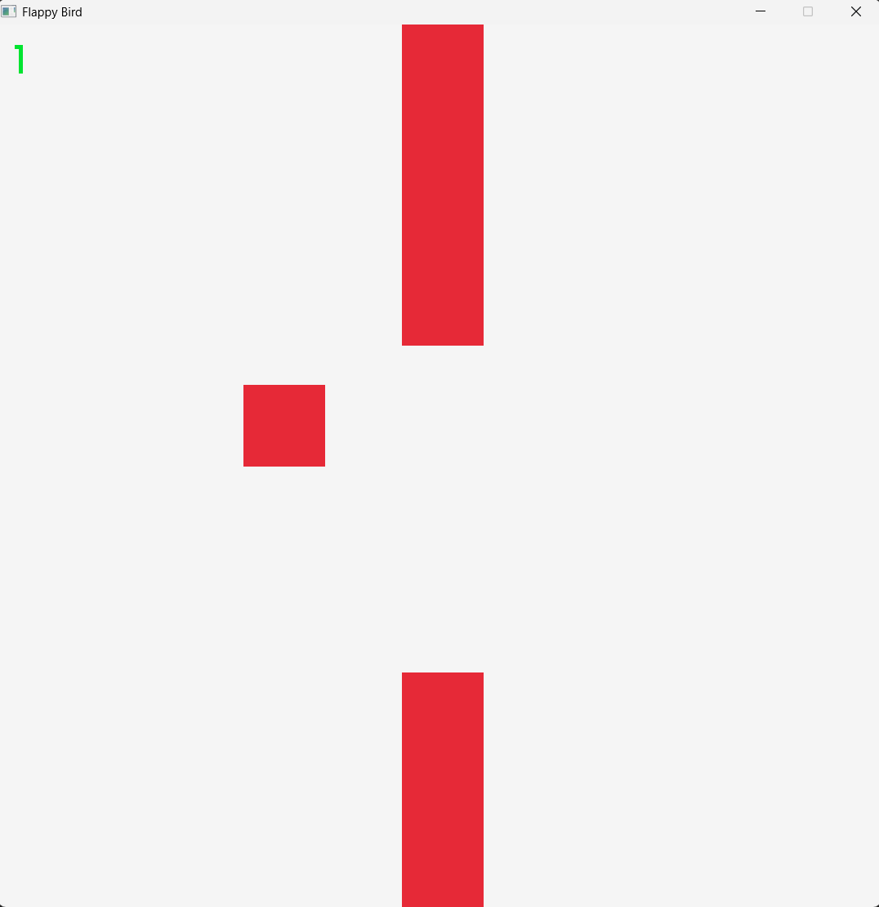
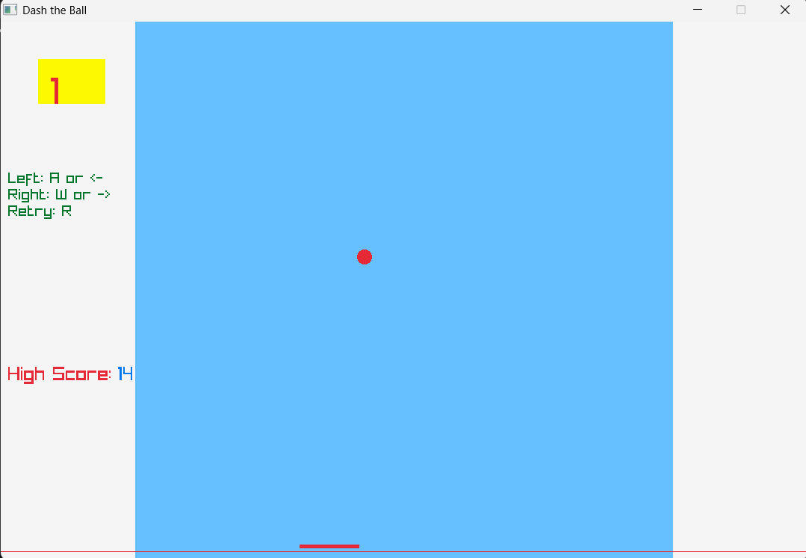

# 🎮 My Raylib Game Projects


Welcome to my collection of **C** games built using the **Raylib** library! 🚀

This repository documents my journey of learning game development from scratch. After working on a college group project (with some AI assistance), I decided to dive deeper and build these games **completely on my own** to master the fundamentals of game logic, collision detection, and engine handling.

---

## 📂 Projects Overview

| Game | Description | Key Learnings |
| :--- | :--- | :--- |
| **[Flappy Box](./Pro1.FlappyBox)** | A geometric take on the classic Flappy Bird. | Game Loops, Basic Logic, Gravity |
| **[Dash The Ball](./Pro2.DashTheBall)** | An action-packed ball dashing game. | Sound Effects, File Handling, Collision |

---

## 🟩 Project 1: Flappy Box
> *Simplicity is the ultimate sophistication.*

**Location:** [`/Pro1.FlappyBox`](./Pro1.FlappyBox)



Inspired by the legendary *Flappy Bird*, this was my very first solo attempt at a game loop. Instead of complex sprites, I used pure geometric shapes (Boxes) to understand the core mechanics of movement and rendering.

### ✨ Key Features
* **Pure C Logic:** Written entirely in C without external game engine editors.
* **Box-Based Graphics:** Minimalist design using Raylib's shape drawing functions.
* **Core Mechanics:** Implements gravity, jumping, and obstacle generation.

### 🕹️ How to Play
1.  Navigate to the `Pro1.FlappyBox` folder.
2.  Run the `.exe` file.
3.  Press **Space** (or the designated jump key) to keep the box afloat!

---

## 🔴 Project 2: Dash The Ball
> *Faster, Louder, Better.*

**Location:** [`/Pro2.DashTheBall`](./Pro2.DashTheBall)



Taking everything I learned from the first project, I leveled up! *Dash The Ball* introduces more complex systems like audio management and state persistence.

### 🚀 What's New & Improved
* **🔊 Audio System:** Learned how to handle Sound Effects (SFX) in Raylib.
* **💥 Advanced Collision:** More precise hitboxes and interaction logic.
* **💾 File Handling:** The game reads/writes files (likely for high scores or settings).
* **🎮 Better Controls:** smoother input handling for dashing mechanics.
* **🔄 Restart System:** Implemented a full game loop with increasing speed and reset without restarting the application.

---

## 🛠️ How to Run
These games are pre-compiled for Windows.

1.  **Clone the repository:**
    ```bash
    git clone [https://github.com/vrjadeja2810-arch/MyRaylibGamePros.git](https://github.com/vrjadeja2810-arch/MyRaylibGamePros.git)
    ```
2.  Navigate to the specific project folder (e.g., `Pro1.FlappyBox`).
3.  Double-click the **`.exe`** file to start playing immediately.

> **Note:** If you want to view or modify the source code, check the `.c` files in the respective directories. You will need a C compiler (like GCC) and the Raylib library installed to recompile them.

---

## 👨‍💻 About The Developer

Hi! I'm **vrjadeja2810-arch**. 
I started this repository to prove to myself that I could build games from the ground up. Unlike my college projects which had AI support, every line of code here was written and debugged by me to ensure I truly understood the **Raylib** framework.

Feel free to explore the code, fork the repo, or suggest improvements!

---

*⭐ If you like these projects, give the repo a star!*
